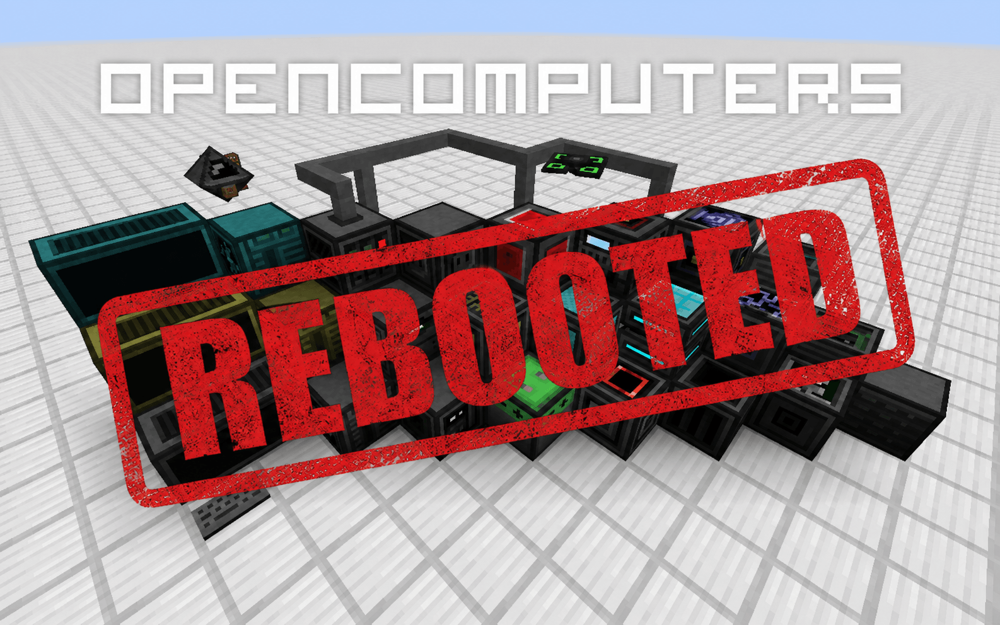

# OpenComputers for Minecraft 1.21.1

This repository is a community-maintained NeoForge port of the original
[OpenComputers](https://github.com/MightyPirates/OpenComputers). It keeps the
classic Lua computers, robots, drones, component network, and OpenOS experience
on modern Minecraft.

> [!WARNING]
> The 1.21.1 port is under active development. Back up worlds before testing it,
> and expect incomplete integrations and compatibility work.

## Requirements

- Minecraft 1.21.1
- NeoForge 21.1 or newer
- Java 21
- Scala is bundled in the OpenComputers JAR.

## Installation

Download a release or CI build and put the OpenComputers JAR in the instance's
`mods` directory:

- `opencomputers-*.jar`

ScalableCatsForce may remain installed when it is required by other mods.

## Building

Clone the repository and run:

```powershell
.\gradlew.bat build
```

On Linux or macOS, use `./gradlew build`. Java 21 is required. Build artifacts
are written to `build/libs`.

For an IntelliJ IDEA development environment, enable the Scala plugin and
import the repository as a Gradle project. Launch the game with the
`Minecraft Client` Gradle run configuration or the `runClient` Gradle task.
Do not run `net.neoforged.devlaunch.Main` directly; that bypasses ModDev's
launch preparation.

If IntelliJ reports that `build/moddev/clientRunVmArgs.txt` is missing, run:

```powershell
.\gradlew.bat prepareClientRun
```

Then launch `Minecraft Client` or `runClient` again. The normal `runClient`
task already depends on `prepareClientRun`, including after `clean`.

## Project status

The port currently targets NeoForge 1.21.1. Remaining integrations and planned
features are tracked in [ROADMAP.md](ROADMAP.md). The 
[OpenComputers wiki](https://ocr.michiyo.me/wiki) is useful for gameplay and Lua
API concepts.

Useful project links:

- [Issues](https://github.com/CaitlynMainer/OpenComputers/issues)
- [Actions and development builds](https://github.com/CaitlynMainer/OpenComputers/actions)
- [Releases](https://github.com/CaitlynMainer/OpenComputers/releases)
- [In-game manual sources](src/main/resources/assets/opencomputers/doc)
- [Lua/OpenOS sources](src/main/resources/assets/opencomputers/loot)
- [Java API sources](src/main/java/li/cil/oc/api)
- [Development Builds](https://ci.pc-logix.com/job/OpenComputers%20Rebooted)

## Contributing

See [CONTRIBUTING.md](CONTRIBUTING.md)

## Using the API

API artifacts use the Maven coordinates `li.cil.oc:opencomputers` with the
`api` classifier. Published versions are available from:

```groovy
repositories {
    maven { url = "https://maven.michiyo.me/releases/" }
}

dependencies {
    compileOnly "li.cil.oc:opencomputers:<version>:api"
}
```

Match `<version>` to the release or build you target.

## License

OpenComputers code is available under the [MIT License](LICENSE). Most original
assets and localization strings are dedicated to the public domain under CC0;
exceptions are identified in the main license. Bundled and adapted third-party
work is documented in [THIRD_PARTY_NOTICES.md](THIRD_PARTY_NOTICES.md), with the
corresponding license texts in [`LICENSES`](LICENSES).

OpenComputers may be included in modpacks, subject to those license terms and
attribution notices.

Thanks to Florian "Sangar" Nücke, Vexatos, payonel, magik6k, Lord Joda, the
OpenComputers contributors, and the maintainers of the modern ports.
